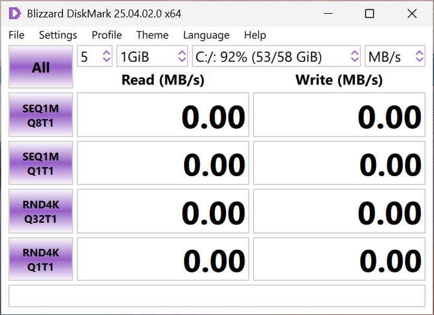

# Blizzard DiskMark

Blizzard DiskMark is a small graphical Windows application for benchmarking disk performance.

## Features

- Measure sequential and random read/write speeds.
- User-friendly graphical interface.

## Installation

1. Download the latest release from the [Releases](#) page.
2. Run the installer and follow the on-screen instructions.

## Usage

1. Launch the application.
2. Select the desired test parameters (e.g., file size, test count).
3. Click the "Start" button to begin benchmarking.
4. View the results displayed in the interface.

## Screenshots

## Contributing

Contributions are welcome! Please follow these steps:

1. Fork the repository.
2. Create a new branch (`git checkout -b feature-name`).
3. Commit your changes (`git commit -m "Add feature"`).
4. Push to the branch (`git push origin feature-name`).
5. Open a pull request.

## Issue Reporting

If you encounter any issues or have suggestions, please report them by opening an issue on the [Issues](#) page. Provide as much detail as possible to help me address the problem.

## License

All rights reserved.

## Acknowledgments

- Inspired by other disk benchmarking tools.
- Thanks to all who laid the groundwork for creating this tool.
